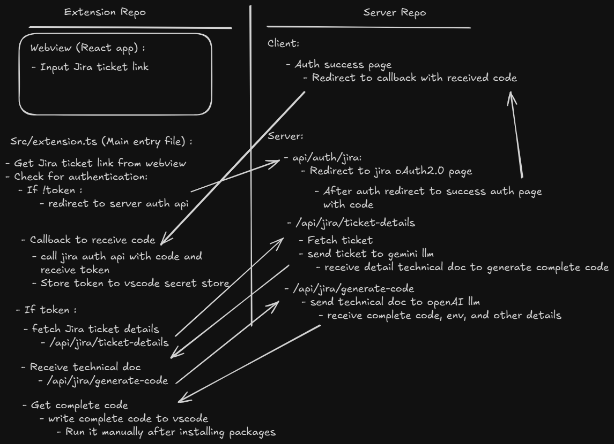

# Jira‑to‑Code VS Code Extension

[](https://www.npmjs.com/package/jira-to-code)
[](LICENSE)
[](https://code.visualstudio.com/)
[](https://nodejs.org/)
[](https://www.typescriptlang.org/)
[](https://github.com/UmangDalvadi/jira-to-code)

Turn a Jira ticket into a ready‑to‑review pull request with one command. This extension connects Jira, Git, and LLMs to automate the busy work: parsing requirements, generating code and tests, opening a PR, and updating Jira. The default LLM can be swapped for your own.

---

## **Flow**



---

## What it does

- Reads a Jira issue by URL.
- Extracts requirements, acceptance criteria, and tasks using an LLM.
- Creates a git branch and a minimal code change scaffold.
- Generates tests and a PR description.
- Opens a pull request.
- Comments on the Jira ticket with QA steps and a review checklist.
- Moves the Jira issue to the next status.

## How it works

1. You paste a Jira URL into the VS Code panel and click Run.
2. The extension authenticates with Jira using OAuth2 and fetches title, description, labels, and acceptance criteria.
3. The extension sends the ticket text, repository context, and coding standards to the LLMs.
4. The extension applies file edits, writes tests, and runs them locally.
5. If tests pass, it commits, pushes, opens a PR, and updates Jira. If tests fail, it can loop to fix them.

## Features

- OAuth2 with Jira Cloud and Jira Server.
- VS Code UI panel for ticket URL input and run status.
- One command workflow from ticket to PR.
- Pull request template support.
- Jira comment with test steps and review checklist.
- Status transition In Progress to Code Review.
- Configurable LLMs for code, tests, and docs.
- Self correction loop for failed tests.

## Requirements

- VS Code 1.90 or newer.
- Node 18 or newer.
- Git installed and logged in for your provider.
- Access to Jira with API scope for read, comment, and transition.
- An LLM API key

## LLM orchestration

- Models
    - Code model for file planning and code edits.
    - Test model for unit tests and fixtures.
    - Docs model for PR and comments.
- Prompts include repository style guide and examples.
- The orchestrator runs a planner then parallel workers.
- Safety rails prevent edits outside the workspace.

---

## 🧪 Development

```bash
# Build webview
cd webview
npm install

# Compile extension
cd ..
npm install

# Debug
Open extension.ts
Press F5 in VS Code
```

## 🛠️ Usage

- Open the Command Palette (`Ctrl+Shift+P`)
- Run: **Jira to Code AI**
- Start converting your tasks!
